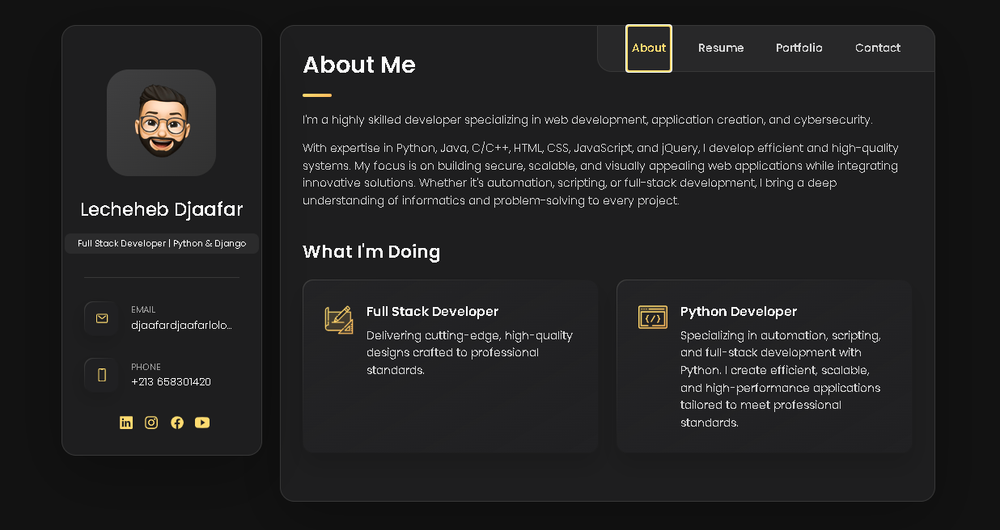
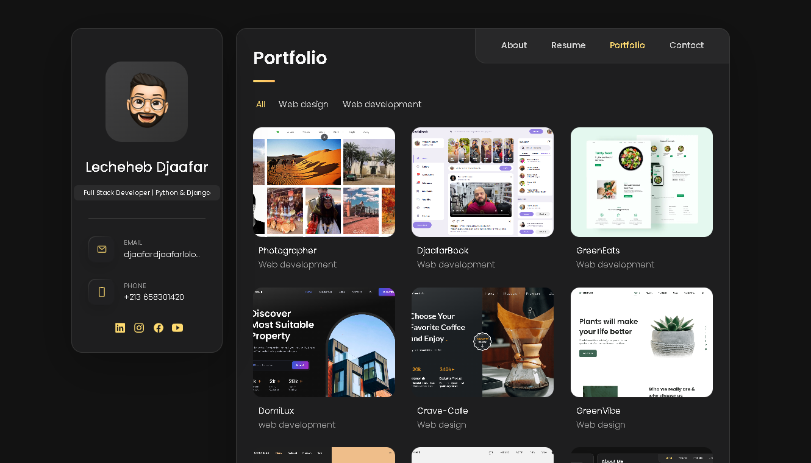
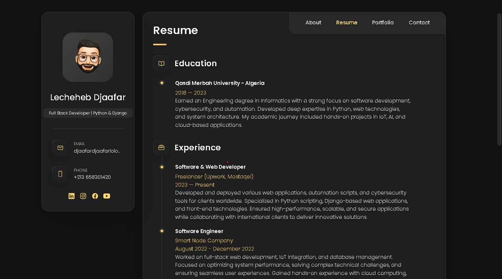

# 📌 My Portfolio

Welcome to my personal portfolio! 🚀 This project showcases my skills, experience, and projects in a visually appealing and interactive way.

## 🌐 Live Demo
🔗 [View Portfolio](https://lechehebdjaafar.github.io/Portfolio-2/)

## 📸 Preview About

## 📸 Preview Portfolio

## 📸 Preview Resume


## 📖 About the Project
This portfolio is designed using **HTML, CSS, and JavaScript**, providing a modern and professional presentation of my work. It features a responsive layout, smooth animations, and an easy-to-navigate structure.

## ✨ Features
- Responsive Design 📱
- Interactive UI/UX ✨
- Dark/Light Mode 🌗 (if applicable)
- Smooth Animations 🎨
- Projects Showcase 💼
- Contact Form 📩

## 🛠️ Technologies Used
- **HTML5**
- **CSS3** (Flexbox, Grid, Animations)
- **JavaScript** (ES6+)

## 🚀 Installation & Usage
1. Clone the repository:
   ```bash
   git clone https://github.com/yourusername/your-portfolio.git
   ```
2. Navigate to the project directory:
   ```bash
   cd your-portfolio
   ```
3. Open `index.html` in your browser.

## 📂 Project Structure
```
📁 portfolio
│── 📄 index.html
│── 📁 assets
│   │── 📁 images
│   │── 📁 css
│   │── 📁 js
└── 📄 README.md
```

## 📬 Contact
If you have any questions or collaboration ideas, feel free to reach out: 
💼 LinkedIn: [Lecheheb Djaafar](https://www.linkedin.com/in/lecheheb-djaafar-226594348/)  
📸 Instagram: [@CodeCraftDL](https://instagram.com/ddos_attack_co)

---
🔹 *Feel free to fork and customize this portfolio to make it your own!*

